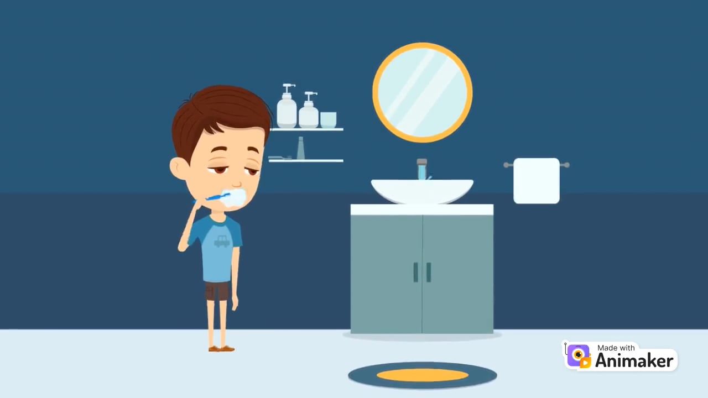

# Achievers

- [Project summary](#project-summary)
  - [The issue we are hoping to solve](#the-issue-we-are-hoping-to-solve)
  - [How our technology solution can help](#how-our-technology-solution-can-help)
  - [Our idea](#our-idea)
- [Technology implementation](#technology-implementation)
  - [IBM watsonx product(s) used](#ibm-ai-services-used)
  - [Other IBM technology used](#other-ibm-technology-used)
  - [Solution architecture](#solution-architecture)
- [Presentation materials](#presentation-materials)
  - [Solution demo video](#solution-demo-video)
  - [Project development roadmap](#project-development-roadmap)
- [Additional details](#additional-details)
  - [How to run the project](#how-to-run-the-project)
  - [Live demo](#live-demo)
  

- [Project summary](#project-summary)
  - [The issue we are hoping to solve](#the-issue-we-are-hoping-to-solve)

    Communities in Africa, particularly women and children, face severe challenges in accessing clean water due to uneven distribution, climate change, and inefficient water resource management. HydroConnect aims to solve this sustainability problem by ensuring equitable access to water through AI-powered insights and efficient resource management.
  - [How our technology solution can help](#how-our-technology-solution-can-help)

HydroConnect uses AI technology to optimize water usage and provide real-time, data-driven insights for equitable distribution and conservation.
  - [Our idea](#our-idea)

HydroConnect is an AI-powered platform designed to tackle the persistent issue of water scarcity in underserved African communities. Many regions, especially rural and remote areas, face challenges in securing adequate, clean water resources. These challenges disproportionately impact vulnerable populations, including women, children, and marginalized communities, exacerbating existing inequalities. Additionally, climate change continues to place further strain on already scarce water resources, leaving communities with limited capacity to plan for water usage effectively.The water challenge issue is experienced in both urban and rural areas making it a crisis; with the initial design of an accessible cross-platform service to help cities affected by water shortages, starting with Kenya's capital. 

HydroConnect leverages IBM Watsonx AI to offer an innovative solution by monitoring and analyzing water consumption patterns in real time. Using AI-generated insights, the platform can forecast demand, alert users about potential shortages, and provide actionable suggestions for water conservation. The AI-driven approach allows for dynamic allocation of water resources, ensuring fair distribution based on current and predicted needs.

Key Features of HydroConnect:

1. AI-Powered Insights: HydroConnect uses Watsonx.ai to track real-time water usage, analyze trends, and predict future consumption patterns, enabling communities to manage their water supply more effectively.
2. Real-Time Alerts and Notifications: The platform sends out timely alerts to notify users of impending water shortages or excess usage and recommends conservation techniques to ensure sustainability.
3. Equitable Water Distribution: HydroConnect ensures that water is distributed equitably by analyzing community needs and allocating resources accordingly, reducing wastage and ensuring that everyone, particularly vulnerable groups, has access to clean water.
4. Mobile-First Design: The platform is designed to be accessible via mobile devices, enabling users in remote regions to easily track and manage water consumption.
5. Community-Centric: HydroConnect fosters community engagement by providing AI-generated suggestions and insights on how to optimize water usage, helping communities make data-driven decisions about water conservation.

HydroConnect improves upon existing solutions by integrating AI-driven forecasting and user-friendly technology to provide a comprehensive, real-time view of water resource management. Unlike traditional water monitoring systems that may be static or inefficient, HydroConnect continuously evolves, allowing communities to react to changing water availability and prepare for future shortages. It addresses a critical gap by ensuring that water allocation is fair, informed, and adaptable, with the goal of improving access to this vital resource.


- [Technology implementation](#technology-implementation)
  - [IBM watsonx product(s) used](#ibm-ai-services-used)

1. Watsonx.ai: HydroConnect uses Watsonx.ai for real-time water consumption analysis and AI-driven insights. It processes data from water usage sensors and generates predictions on future water demand, enabling the platform to suggest conservation techniques and manage equitable distribution.
The code below demonstrates how to use Watsonx.ai for processing water consumption data from sensors and providing real-time analysis to predict future demand.This code processes sensor data and sends it to Watsonx.ai for real-time AI predictions, helping HydroConnect suggest conservation techniques and manage equitable water distribution.

                                      Code can be found on folder named Watsonx.ai for Real-time Water Consumption Analysis: 
                                      https://github.com/GloriaKinyanjui/HydroConnect/commit/22db08278e08c6bbe85f458958e36f403d9d61bf

2. Watsonx.governance: This product is used to ensure that all AI-generated insights and decisions within HydroConnect comply with governance rules and regulations, particularly around equitable distribution and ethical resource management.The code below uses Watsonx.governance to ensure that all AI decisions related to water management comply with governance policies.The code verifies that the AI-generated decisions in HydroConnect adhere to governance policies, ensuring ethical water distribution.

                                       Code can be found on folder named Watsonx.governance for AI Model Governance
                                       https://github.com/GloriaKinyanjui/HydroConnect/commit/4e540a7d487967e53d6e21240d4e8d91b3c284ec

How It Helps HydroConnect: Governance ensures transparency and fairness in decision-making processes, particularly when dealing with vital resources like water in vulnerable communities.   


3. Watsonx Assistant: The Watsonx Assistant enables HydroConnect to provide interactive, AI-driven communication with users, offering personalized water conservation tips and answering user questions regarding water supply in their area. This assistant also facilitates real-time support and alerts.
Here’s how Watsonx Assistant is integrated into HydroConnect to offer real-time support, answer questions, and provide personalized water-saving tips.This code allows users to communicate with Watsonx Assistant, which offers tailored water conservation advice and real-time support.

                                       Code can be found on folder named Watsonx Assistant for User Interaction
                                        https://github.com/GloriaKinyanjui/HydroConnect/commit/c38a1193b70f189890dae43ca8b2e2f72aa5f334
   

## Sample Data

https://github.com/GloriaKinyanjui/HydroConnect/commit/8cc22af25f284f7975dd4aa4ea0195daa71b294b

The sample data in this repository simulates water usage and conversation inputs for the HydroConnect platform. 

1. **Watson Assistant**: Use the `conversation_samples.csv` to test the chatbot with pre-defined prompts related to water conservation tips.
2. **Watsonx.ai**: The `water_usage_samples.csv` contains historical water usage data for testing prediction algorithms and AI insights.

This data helps demonstrate how the AI models respond to real-world scenarios and provide actionable insights.


  - [Other IBM technology used](#other-ibm-technology-used)

1. Watson Machine Learning

In HydroConnect, Watson Machine Learning is used to build and deploy AI models that forecast water demand based on historical and real-time usage data. By analyzing the consumption trends across various communities, the AI models predict future water shortages and surpluses, enabling dynamic and equitable distribution of resources. This helps communities anticipate and plan for upcoming water needs, thereby improving overall water resource management.

              Code can be found on folder named- Watson Machine Learning Integration for Water Demand Forecasting
              https://github.com/GloriaKinyanjui/HydroConnect/commit/802ac7db125fe2166d3e0469f08022522dc22d46

Considerations for African Context:

i Data Sources: Reliable data on water usage, population density, and weather patterns may not always be readily available in some African regions. The model would need access to localized data from government databases, NGOs, or remote sensors for accurate predictions.

ii. Climate Variability: African countries experience diverse climate conditions—ranging from arid regions like the Sahara to tropical rainforests. The code should account for these differences in the data collection and analysis to ensure accurate predictions. For instance, areas with frequent droughts may require additional features like soil moisture or groundwater levels.

iii. Infrastructure Limitations: In some parts of Africa, water supply infrastructure may be limited or unreliable. Therefore, the model should account for not just natural factors but also infrastructure-based constraints that can affect water availability.

iv. Adaptable for Rural and Urban Settings: The African continent has a mix of highly urbanized cities and remote rural areas. The code could be adapted to predict water needs in both urban environments (high population density) and rural communities where water access is limited due to geographical or infrastructural barriers.

v. Localized Variables: Variables specific to the African continent, such as seasonal rainfall patterns (e.g., long and short rains in East Africa), agricultural water needs, and migration patterns, could be included to make the model more accurate.

How This Benefits the Continent:

-Drought Prediction: Countries like Kenya, Ethiopia, and Nigeria could benefit from forecasting water shortages, helping governments and NGOs to prepare for droughts.

-Urban Water Planning: In cities like Lagos, Nairobi, or Cape Town, where urban water demand is rapidly increasing, the model can be used to predict surges in water usage and plan accordingly.

2. Watson Studio

Watson Studio is employed in HydroConnect to manage data analytics workflows. It helps with cleaning and processing large datasets collected from water usage sensors and other sources. Using Watson Studio, the team was able to collaborate on data models that deliver actionable insights on water consumption patterns. This platform allows for continuous model training and refinement, ensuring the AI predictions remain accurate and relevant as more data is collected.
Watson Studio is instrumental in managing data analytics workflows, collaborating on datasets, and refining AI models. Below is a code snippet that shows how to clean and process large datasets from water sensors using Watson Studio.Watson Studio is used to preprocess the sensor data by handling missing values and creating new features like the time of day and day of the week. The cleaned data can then be uploaded to Object Storage or shared within Watson Studio to build more accurate models.

                   Code can be found on file named Watson Studio Integration for Data Management
                   https://github.com/GloriaKinyanjui/HydroConnect/commit/8c151554893d26b5430f5975bdde2481a1549bd0


3. Natural Language Understanding

HydroConnect uses Watson’s Natural Language Understanding (NLU) service to analyze and extract key information from community feedback regarding water access. This feedback, which may include written reports or social media discussions, is processed using NLU to gauge public sentiment and identify recurring issues related to water access and resource management. The AI then incorporates these insights to improve water distribution strategies, making the system more responsive to community needs.

Hydroconnect integrates IBM Watson NLU to analyze water-related reports, extracting key insights such as sentiment and urgency regarding water supply issues. This feature helps local authorities prioritize interventions.  

Code found on the folder named: Using Watson NLU for sentiment analysis on water-related text: https://github.com/GloriaKinyanjui/HydroConnect/commit/df9ebc4d9655d891e3c47cf1a806c7f468c20e28

               
               Code found on the folder named: API integration with IBM Watson services (Speech-to-Text or Natural Language Understanding)
              https://github.com/GloriaKinyanjui/HydroConnect/commit/281037eac8dc78b1afad38dbd7234e2da516919f

4. Speech to Text

The Speech to Text service is integrated into HydroConnect to convert verbal feedback from community members into text data. This feature is particularly useful for users in remote areas where written input might be less accessible. By processing voice inputs, the platform captures a wider range of user concerns and suggestions, which can then be analyzed to enhance the platform's performance and responsiveness.

The `watson_speech_to_text` file shows integration of IBM Watson Speech-to-Text API to convert audio files into text. This is used for processing community feedback related to water usage.


5. Text to Speech

HydroConnect employs Text to Speech to make information more accessible to users in rural communities with low literacy rates. The platform converts key notifications and AI-generated water conservation tips into audio messages, ensuring that all users—regardless of their literacy level—can access critical updates and instructions on managing water resources.
IBM Watson's Text to Speech service will be implemented in Hydroconnect to convert key notifications or tips into speech, which is crucial for users in rural areas with low literacy levels.This code takes a text notification and converts it into an audio file (output_audio.wav) that can be sent to users. You can modify it to include other language voices if needed.
                               
                                Code can be found on folder named Text to Speech Implementation:
                                https://github.com/GloriaKinyanjui/HydroConnect/commit/ce7a523b848e6c5608fcb0040b103ca251511b7e
                                

The incorporation of Text-to-Speech for low-literacy users and Language Translator to translate conservation messages into local languages reflects deep user empathy. This innovative feature makes HydroConnect accessible to diverse populations, helping overcome barriers like language and literacy that are often overlooked in tech solutions for rural areas.


6. Language Translator

The Language Translator service is crucial for HydroConnect’s scalability across different regions in Africa. Given the diversity of languages spoken in these areas, the platform uses IBM’s Language Translator to convert its content—such as water conservation tips and community alerts—into multiple local languages. This ensures that language barriers don’t hinder equitable access to water resources or the adoption of water-saving practices.
Integration with the IBM Watson Language Translator service to translate notifications and tips into different local languages, which is crucial for scaling across Africa's diverse language region.In this example, the Language Translator converts the message from English to Swahili ('sw'). One can change the target language code to translate the message into other local African languages based on the regions where HydroConnect is deployed.


                                Code can be found on Language Translator Implementation:
                                https://github.com/GloriaKinyanjui/HydroConnect/commit/0435d77a732b05b63da4c3ecde3cfea4b54577c1

## Project summary

### The issue we are hoping to solve

Water scarcity is a significant issue in many parts of the world, especially in rural and semi-urban areas. In regions in Africa like Kenya, communities face challenges accessing clean water, leading to health risks and decreased quality of life. Efficient water management is crucial for sustainability, especially in areas prone to droughts and inconsistent rainfall.


### How our technology solution can help

HydroConnect empowers communities with AI-driven tools to monitor and manage water resources efficiently.


### Our idea

Water scarcity is one of the greatest challenges facing global communities today, with over 2 billion people lacking access to clean, safe drinking water. In many developing regions, such as rural and semi-urban areas in Kenya, water management systems are either outdated, non-existent, or poorly maintained. This leads to inefficient water usage, with communities relying on manual processes to gather water, often traveling long distances. Moreover, inconsistent water supply due to poor infrastructure and climate challenges exacerbates the problem.

HydroConnect is designed to address these inefficiencies by using AI and real-time data to enhance water resource management. Our platform enables users, water management organizations, and municipalities to monitor water consumption, predict future shortages, and optimize water distribution. By leveraging IBM’s Watson AI tools, HydroConnect provides predictive analytics, helping communities prepare for dry periods and conserve resources more effectively.

More detail is available in our [description document](./docs/DESCRIPTION.md).

### Solution architecture

Diagram and step-by-step description of the flow of our solution:


1. The user accesses the HydroConnect platform by logging in through a secure authentication process. Upon login, they are directed to the main dashboard, which displays their community's water usage and current water levels.
2. HydroConnect integrates with IoT water sensors installed in homes and public water stations. These sensors continuously monitor water usage and report the data to the platform in real time.
3. The collected data is processed using IBM Watson AI, which identifies water usage patterns across different households and communities. AI analyzes this data for insights like peak consumption times, potential wastage, and anomalies in usage
4. Watson AI's machine learning models generate predictive insights, helping users anticipate shortages or potential overuse. If any concerning patterns are detected, HydroConnect sends alerts to the user via the platform's notification system.
5. Users can view detailed reports of water usage at both the household and community levels. The Community Analytics Page displays aggregated data and provides suggestions on how the community can improve water conservation, powered by Watson’s recommendation algorithms.
6. Based on Watson's analysis, HydroConnect offers personalized water-saving tips and suggestions to users. These tips are displayed on the dashboard and can be sent via email or SMS.
7. Users can generate comprehensive water usage reports for specific periods. These reports can be downloaded or shared with local water authorities and community leaders to help with policy-making and improving water management practices.
   
## Presentation materials

_INSTRUCTIONS: The following deliverables should be officially posted to your My Team > Submissions section of the [Call for Code Global Challenge resources site](https://cfc-prod.skillsnetwork.site/), but you can also include them here for completeness. Replace the examples seen here with your own deliverable links._

### Solution demo video

[](https://vimeo.com/1018918117?share=copy#t=0)

### Project development roadmap

The project currently does the following things.

- Feature 1: Real-Time Water Usage Monitoring
HydroConnect allows users to track real-time water consumption data through IoT sensors installed in their homes or community water centres. This data is processed and visualized through a user-friendly dashboard, giving users and water authorities a clear understanding of how water is being used in various regions.

- Feature 2: : AI-Powered Predictive Insights
Using IBM Watson AI, HydroConnect analyzes water usage patterns and forecasts future demand. The AI generates predictions on water shortages and provides communities with early warnings, helping them take proactive measures to manage water resources more efficiently.

- Feature 3: Community-Based Analytics and Recommendations
HydroConnect aggregates water consumption data at a community level and generates insights that help local governments and NGOs make data-driven decisions. The platform also provides personalized water conservation recommendations to users, encouraging collective action to prevent wastage.

In the future we plan to:

1. Expand Geographic Reach
Scale the platform to more communities across Kenya and other African countries affected by water scarcity. We aim to collaborate with local governments and international NGOs to bring HydroConnect to regions where water management infrastructure is limited.

2. Introduce Multilingual Support
To ensure accessibility in diverse regions, we will integrate IBM Watson Language Translator to offer HydroConnect’s services in multiple African languages. This will help bridge language barriers and increase the adoption of the platform in rural areas.

3. AI-Enhanced Water Resource Management
We plan to deepen the use of AI, moving beyond water usage prediction to include smart water distribution that dynamically adjusts based on consumption patterns, available resources, and community needs. This will help optimize water allocation in areas experiencing scarcity.

4. Educational and Training Modules
Incorporate training modules that teach users about water conservation, empowering them to be more proactive in managing their resources. This feature will promote sustainability through community education.

See below for our proposed schedule on next steps after Call for Code 2024 submission.


## Additional details

HydroConnect was born out of my personal experience growing up in Kenya, where access to clean water was a constant challenge. I remember the long walks to fetch water and the strain it placed on families. These early experiences shaped my desire to create a solution that addresses water scarcity and empowers communities. While working solo on this project, I’ve poured my passion into designing a user-friendly platform that can help families and communities track and optimize water usage to minimize waste and ensure sustainability.

The design phase of HydroConnect has been completed using Figma, where I’ve developed the platform’s key features, including real-time water usage tracking, AI-based water conservation tips, and community analytics. I’ve structured a clear roadmap for how the platform will integrate with IBM’s Watson AI for data processing and predictive analytics. I hope to turn this vision into a fully functioning product that supports both urban and rural communities.

While I am currently working solo, I see HydroConnect growing into a solution driven by teamwork and collaboration. My goal is to take the next steps by bringing technical talent on board, securing funding, and refining the platform’s features to align with the needs of water-stressed communities. The challenge of working alone has only strengthened my resolve, and I am excited to see HydroConnect evolve and make a real-world impact in ensuring water security for all.


### Code in HTML
The frontend of Hydroconnect, originally designed in Figma, has been converted to HTML and can be found in the `frontend html-design` folder.

### Live Code :

**Frontend**

The front-end of HydroConnect is built using HTML and JavaScript. The interface allows users to input water-related queries, which are sent to the Watson Assistant for answers. It also provides real-time water usage predictions based on data from the back-end.

Key Features:
1. User Input Form: An input field that allows users to ask questions about water conservation and water supply.
2. Dynamic Interaction: User queries are sent to the back-end, and the response from Watson Assistant is displayed on the page.

(https://github.com/GloriaKinyanjui/HydroConnect/commit/6c9a6a1459ae9dea1545feede11cf5b7dafb4bf3)

**Backend**

The back-end of HydroConnect is responsible for interacting with IBM Watson services. Built using Python (Flask) or JavaScript (Node.js), it handles requests from the front-end, sends them to Watson APIs (e.g., Assistant, Machine Learning, etc.), and returns the results.

Key Features:
1. Watson Assistant Integration: Processes user queries about water management and provides responses.
2. AI Insights via Watsonx.ai: The back-end retrieves real-time water usage data from sensors and feeds it into Watsonx.ai models to generate predictions on future water needs and suggest conservation techniques.
3. Accessibility Integration: Using Watson Text-to-Speech, the back-end converts text-based water conservation tips and alerts into audio, making information accessible to users with low literacy levels.
4. Language Translation: IBM’s Language Translator API is integrated to convert water conservation tips into multiple local languages, ensuring users across diverse regions in Africa can understand key messages.

   This Python code interacts with the front-end by processing user queries, sending them to Watson Assistant, and returning responses to the user.
https://github.com/GloriaKinyanjui/HydroConnect/commit/540dfa9f6dc39adbb6787e13b3bd55252d9be6ad


### Live demo

## Front-End and Back-End Integration with Watson Assistant :

 Link: https://github.com/GloriaKinyanjui/HydroConnect.git

This project integrates IBM Watson Assistant into the HydroConnect platform to enable AI-powered interactions related to water management and conservation. 

### Front-End:
- The front-end consists of an HTML form where users can type their queries related to water resources.
- It sends these queries to the back-end using a JavaScript handler (`watson-assistant.js`).
  
### Back-End:
- The back-end is responsible for sending the user's message to the Watson Assistant API.
- Once Watson Assistant processes the message, the response is sent back and displayed in the front-end.

You can find a running system to test at:
### Steps to Run the Project:
1. Install `http-server` via npm to serve the files.
2. Run the following command in the project folder:
   ```bash
   http-server public


See our [description document](./docs/DESCRIPTION.md) for Project website and Prototype.

---
